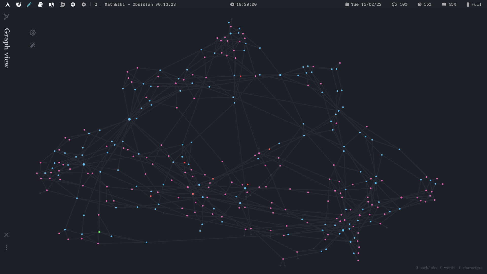

# MathWiki

An Obsidian.md vault for my (mostly math) course notes in university, integrated with my [dotfiles](https://github.com/zhaoshenzhai/dotfiles).

## Graph View |  Definitions |  Propositions |  Theorems |  Axioms

