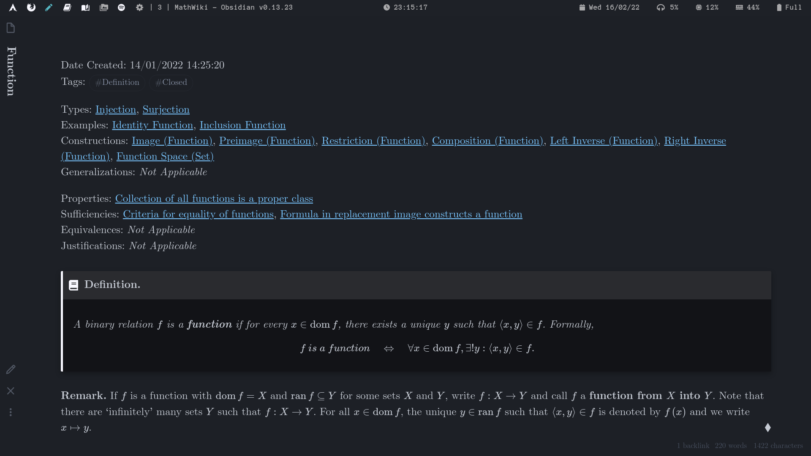

# :pencil: MathWiki

## :information_source: About

An [Obsidian.md](https://obsidian.md) vault for my math course notes in university (integrated with my [dotfiles](https://github.com/zhaoshenzhai/dotfiles)).

These notes are meant to be a distilled version of the math I've learnt, where ideas, formulations, and important results are broken down into their atomic components of definitions, propositions, and theorems for clarity, precision, and accessibility.

### File structure

Each note is currently one of four types:

* **Definition**, either of an `object` or of a `notion`, which links to:
    * Types: _Objects/notions of type `object`/`notion` with additional restrictions. (Definition)_
    * Examples: _Objects that are specific instances of `notion` - including its proof, if necessary. (Definition/Proposition)_
    * Constructions: _Objects that can be defined from `object`, or notions derived from `notion`. (Definition)_
    * Generalizations: _Abstractions of `object`/`notion`. (Definition)_  
    * Properties: _Statements regarding `object` or necessary conditions of `notion`. (Proposition/Theorem)_
    * Sufficiencies: _Proofs that other objects are of type `object` or sufficient conditions of `notion` (Proposition/Theorem)_
    * Equivalences: _Equivalent definitions for `object` or biconditionals between notions and `notion`. (Proposition/Theorem)_
    * Justifications: _Proofs of well-definition of `object`. (Proposition)_

* **Proposition** and **Theorem** (differentiated by 'importance'), including both statement and `proof` regarding `object`/`notion`, which links to:
    * Proved by: _Statements in which `proof` depends crucially on. (Axiom/Proposition/Theorem)_
    * Generalizations: _Statements and proofs of generalizations of `object`/`notion`. (Proposition/Theorem)_
* **Axiom**, written as a formal `statement` within a certain framework, which links to:
    * Equivalences: _Equivalent statements - including its proof. (Axiom/Proposition/Theorem)_
    * Constructions: Objects/notions that crucially depend on `statement`. (Definition)

### Obsidian template

I do not directly write my notes in Obsidian since its Vim mode is not comprehensive (and the formatting is weird); see [dotfiles](https://github.com/zhaoshenzhai/dotfiles) for my Neovim setup. Therefore, most of my Obsidian customization is on its appearance and [navigation hotkeys](.obsidian/hotkeys.json).

Theme: [Minimal](https://github.com/kepano/obsidian-minimal).

Pluggins:
* [Admonition](https://github.com/valentine195/obsidian-admonition): A replacement for the `mdframed` package in LaTeX.
* [Advanced Appearance](https://github.com/kepano/obsidian-advanced-appearance): Set the font to `CMU Serif` (detault LaTeX font).
* [Extended MathJax](https://github.com/xldenis/obsidian-latex): Add macros in [`preamble.sty`](preamble.sty).
* [Hider](https://github.com/kepano/obsidian-hider): Hide title bars, scroll bars, etc.
* [Sliding Panes (Andy's Mode)](https://github.com/deathau/sliding-panes-obsidian): Stack panes side-by-side.
* [Vault Statistics](https://github.com/bkyle/obsidian-vault-statistics-plugin): _302 notes, 654 links, 30 attachments, 26773 words._

## :telescope: Graph View:  Definitions |  Propositions |  Theorems |  Axioms

## :page_with_curl: Sample Pages

